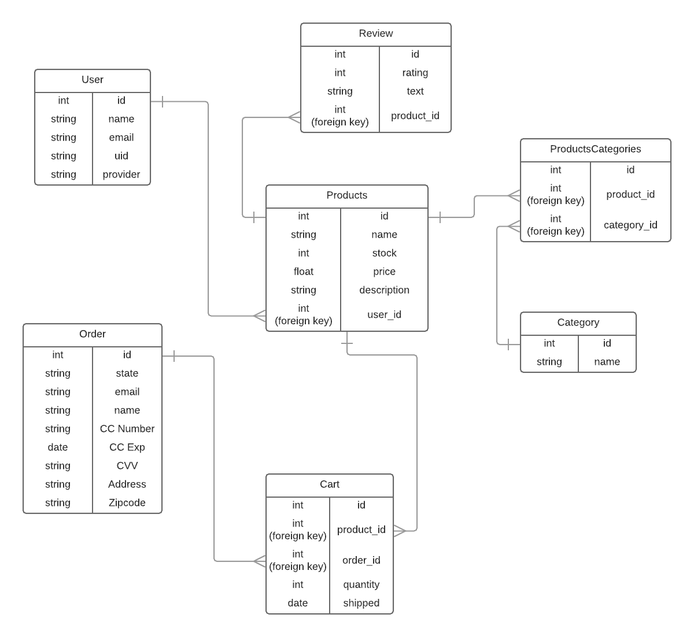
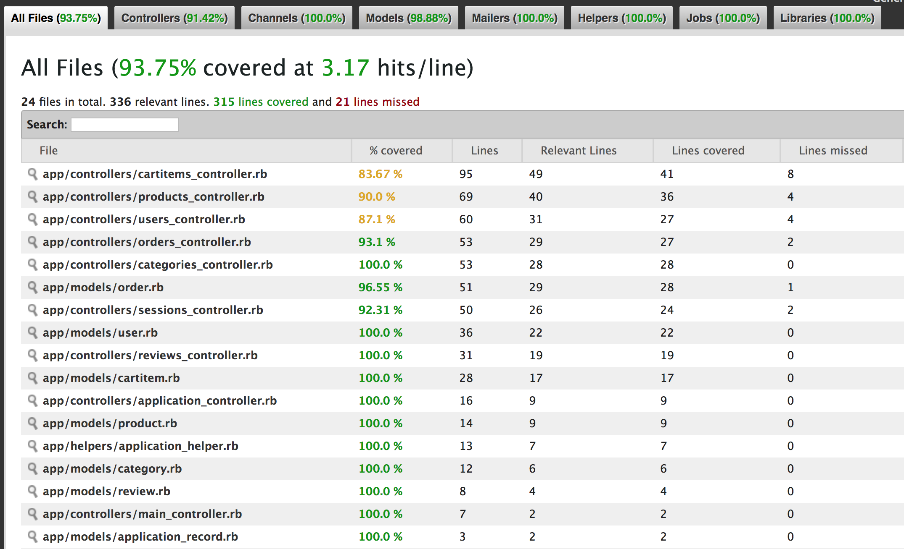

# bEtsy
[Much like other e-commerce platforms](https://www.etsy.com/), our team of four created an online store where a wide variety of products can be listed and sold by any user. This project focused on reinforcing the major components of Rails, model validations, testing, and more complex logic such as user authentication.

This was a [Stage 3](https://github.com/Ada-Developers-Academy/pedagogy/blob/master/rule-of-three.md) project requiring us to expand upon what we learned in class at [Ada Developers Academy](https://www.adadevelopersacademy.org/).

## Team Leaders
Each of the four group members acted as one of the team leaders during the project.  We rotated after 7 days.  Below are the responsibilities handled during that week: 

- **Stand Up Leader**
  - Notifies team members about meeting schedule and ensures that everyone is present and ready
  - Takes notes about each person's daily report in Stand Up
  - Keeps the meeting moving
- **Task Leader**
  - Leads discussion on task assignment and prioritization
    - Decide if a task should be completed alone or in a pair
    - Assign tasks based on...
      - Individual comfort
      - Desire
      - Ability
  - Ensures the Trello board stays up to date

## Stand Up Meetings
We had a daily AM standup, where we reviewed any changes that would be pushed into the master branch and provided code reviews before accepting any major changes. 

## Team
- [Angela](https://github.com/knockknockhusthere): Standup Leader (Week 1)
- [Cara](https://github.com/cbrenn): Task Leader (Week 2)
- [Dikla](https://github.com/diklaaharoni): Standup Leader (Week 2)
- [Karinna](https://github.com/karinnainiguez): Task Leader (Week 1)

## Project Learning Goals
- Core comprehension of:
  - Routes
  - Controllers
  - Models
  - Views
- User based application logic
- User authentication
- Testing on models and controllers
- Agile practices
- Feature branch management with Git
- Group project ownership

## Expectations
Build an online system for listing, selling, reviewing, and buying a wide variety of products listed by multiple merchants.

### Project Details
- Entity Relationship Diagram designed by team: 

- Team documented progress on a [Trello Board](https://trello.com/b/xQMD4GLc/petsy-feels)
- 93.75% Test Coverage (measured using SimpleCov):

### User Stories
#### Guest User (Unauthenticated)
As a guest to the website (not signed in) I **can**:

- Browse all products
- Browse products by category
- Browse products by merchant (users)
- View any individual product with additional details
- Leave a review for a product providing:
    - A text review
    - A rating out of 5
- Add in-stock products to my cart
- Remove products from my cart
- Change the quantity of an existing product in my cart
- Purchase the items in my cart, providing:
    - Email Address
    - Mailing Address
    - Name on credit card
    - Credit card number
    - Credit cart expiration
    - Credit Card CVV (security code)
    - Billing zip code
- Purchasing an order makes the following changes:
    - Reduces the number of inventory for each product
    - Changes the order state from "pending" to "paid"
    - Clears the current cart
- After purchasing an order, I can view a confirmation screen including:
    - Each item in the order with a quantity and line-item subtotal
    - A link to the item description page
    - Order total price
    - Date/time the order was placed
    - The current status of the order
- Sign up to be a merchant using OAuth
    - Every merchant must have a username
- Sign in to my merchant account using OAuth

As a guest I **cannot**:

- Add products to the cart that are out of stock
- View any link or page to manage any products
- View any of the account pages

#### Authenticated Users
As a signed-in user, I **can**:

- Do everything a guest user can do except for sign up and sign in
- Sign out
- Create new categories (categories are shared between all merchants)
- Create a new product providing:
    - name
    - description
    - price
    - photo URL
    - stock
- Assign my products to any number of categories
- Retire a product from being sold, which hides it from browsing
- View an account page to edit/update my existing products
- View an account page showing my order fulfillment
- On the order fulfillment page:
    - Total Revenue
    - Total Revenue by status
    - Total number of orders by status
    - Filter orders displayed by status
    - Link to each individual order
    - A list of orders including at least one of my products:
        - Each order item sold by me with a quantity and line-item subtotal
        - A link to the item description page
        - DateTime the order was placed
        - Link to transition the order item to marked as shipped
        - The current status of the order ("pending", "paid", "complete", "cancelled")
- View an individual order to see the user's:
    - Name
    - Email address
    - Mailing address
    - Last four digits of their credit card
    - Credit card expiration date

As a signed-in user, I **cannot**:

- Review my own products
- View order items from a shared order that belong to another merchant
- View another user's private data (i.e. order fulfillment or product management)

### Validations
The following validations have been applied to each of the models:

#### User
- Username must be present
- Username must be unique
- Email Address must be present
- Email Address must be unique

#### Product
- Name must be present
- Name must be unique
- Price must be present
- Price must be a number
- Price must be greater than 0
- Product must belong to a User

#### Order
- An Order must have one or more Order Items

#### OrderItem
- Must belong to a Product
- Must belong to an Order
- Quantity must be present
- Quantity must be an integer
- Quantity must be greater than 0

#### Review
- Rating must be present
- Rating must be an integer
- Rating must be between 1 and 5

## Feedback
[Instructor feedback](https://github.com/Ada-C9/betsy/pull/21#issuecomment-387176282) given to team after presentation and code submission.
